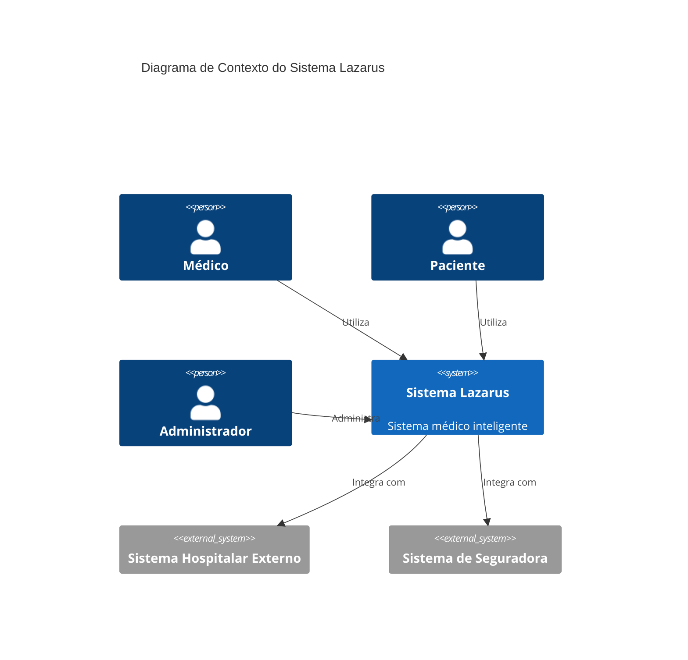
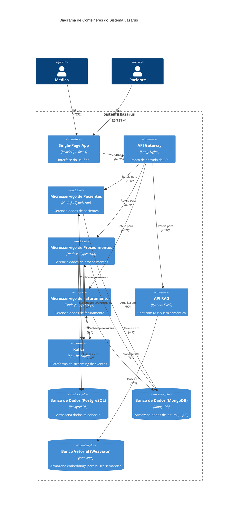
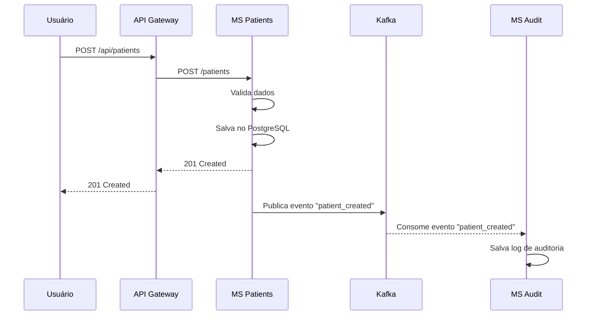

# Diagramas de Arquitetura

Esta seção contém diagramas detalhados que ilustram a arquitetura do sistema Lazarus.

## Diagrama de Contexto

O diagrama de contexto mostra o sistema Lazarus como uma caixa preta, interagindo com seus usuários e outros sistemas.

## Diagrama de Contêineres

O diagrama de contêineres mostra os principais componentes de alto nível do sistema Lazarus e como eles interagem.

## Diagrama de Sequência - Criação de Paciente

Este diagrama de sequência ilustra o fluxo de criação de um novo paciente.

