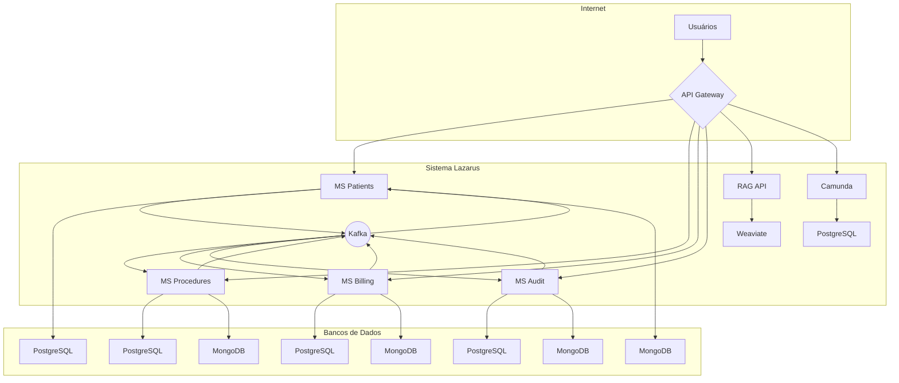

# Visão Geral da Arquitetura

O sistema Lazarus é projetado com uma arquitetura de microsserviços moderna, focada em escalabilidade, resiliência e manutenibilidade. Esta seção descreve os princípios e componentes chave da nossa arquitetura.

## Princípios de Design

- **Single Responsibility Principle**: Cada microsserviço tem uma única responsabilidade bem definida.
- **Desacoplamento**: Os serviços são independentes e se comunicam de forma assíncrona.
- **Escalabilidade**: Cada serviço pode ser escalado independentemente dos outros.
- **Resiliência**: O sistema é tolerante a falhas e pode se recuperar de erros.
- **Observabilidade**: O sistema é projetado para ser monitorado e debugado facilmente.

## Componentes Principais

- **Microsserviços**: 9 serviços independentes que implementam a lógica de negócio.
- **API Gateway**: Ponto de entrada único para todas as requisições externas.
- **Kafka**: Plataforma de streaming de eventos para comunicação assíncrona.
- **Camunda**: Motor de regras e workflows para processos de negócio.
- **RAG System**: Sistema de chat com IA e busca semântica.
- **Bancos de Dados**: PostgreSQL, MongoDB e Redis para persistência e cache.

## Diagrama de Arquitetura

O diagrama a seguir ilustra a arquitetura geral do sistema Lazarus:

## Fluxo de Dados

1. **Requisições Síncronas**: Requisições HTTP/S chegam ao API Gateway, que as roteia para o microsserviço apropriado. O microsserviço processa a requisição e retorna uma resposta síncrona.

2. **Comunicação Assíncrona**: Quando um microsserviço precisa notificar outros serviços sobre uma mudança de estado, ele publica um evento no Kafka. Outros serviços que estão inscritos nesse tópico consomem o evento e reagem de acordo.

## Padrões de Projeto

- **CQRS (Command Query Responsibility Segregation)**: Utilizamos bancos de dados separados para escrita (PostgreSQL) e leitura (MongoDB), otimizando cada um para sua respectiva tarefa.
- **Event Sourcing**: Todas as mudanças de estado são capturadas como uma sequência de eventos, proporcionando um histórico completo e auditável.
- **Saga Pattern**: Para transações distribuídas que abrangem múltiplos serviços, utilizamos o padrão Saga para garantir a consistência dos dados.

Para mais detalhes sobre cada componente, consulte as seções específicas desta documentação.

